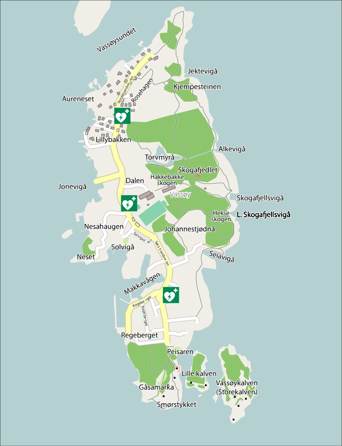

## Hjertestartere

Der 3 hjertestartere på Vassøy.

- En er nord på Nordstrandveien 39 ved garasjen.
- På branddepoet (tilgjenglig for brannpersonalet)
- Sørstrandveien 905

Plassering illusteret i kart ned forbi

## "Ambulanse"

Vassøy har egen ambulanse/syketransport bil til å hjelpe å få folk til Rygerdoktor eller eventuelt helikopter

Ordningen på Vassøy er at trenger du akutt hjelp må du ringe 113 eller legevakten.

Mannskapet på Rygerdoktoren eller Akuttmottaket ringer Sigurd Helgesen og ber om hjelp til transport når det er nødvendig. All kontakt skjer gjennom disse kanalene.

